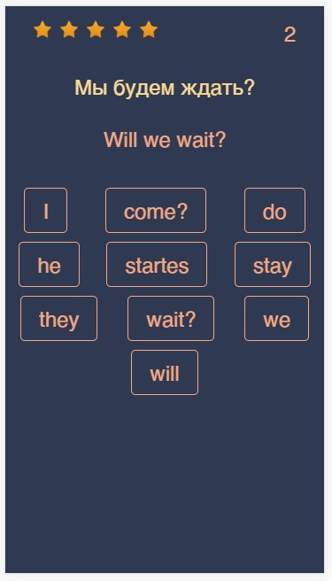

# [Enskill](https://aruytehno.github.io/enskill/)

## Задачи, которые решает проект:
* Адаптивное обучение языку в зависимости от потребностей пользователя
* Сайт разработан для тренировки правописания и запоминания слов.
* Каждая группа состоит не более чем из 12 слов, для того что бы соблюдалась цикличность нескольких повторений

## Дополнительные ресурсы:
* [Paragraph77.net](https://paragraph77.net/)
* [Eslfast.com](https://www.eslfast.com/)
* [Texthandler.com](https://ru.texthandler.com/text-tools/letter-case-converter/)
* [Bootstrap 5.1.1 Navbar Multi Level and Mega Menu](https://codepen.io/typo3-freelancer/pen/poEvyGj)
* [Footer](https://codepen.io/idesignsmf/pen/WgjXeo)

## Инструменты для работы:
* [jsoneditoronline](https://jsoneditoronline.org/#)

# Проблемы проекта, которые необходимо решить: 
## Технические:
- убрать пробелы с краев введённой фразы или слова ✅
- Убрать зависимость от вводимого регистра при проверке слов ✅
- Подключение локальных библиотек Bootstrap для использования без интернета
- Поправить иконки на футере

## Методические:
* Настроить локальный профиль пользователя в куки для сохранения статистики
* Настроить систему очков при изучении наборов слов
* По изученным словам предлагать готовые фразы

# Терминология, тесты и прочее:
## Сертификаты:
- CEFR — Common European Framework of Reference for Languages (Написать переводы)
- IELTS — International English Language Testing System
- TOEFL — Test of English Language as a Foreign Language
- iBT — Internet Based Test
- PBT — Paper Based Test
- CPE — Certificate of Proficiency in English
- CAE — Certificate in Advanced English
- FCE — First Certificate of English
- PET — Preliminary English Test
- KET — Key English Test

## Уровни владения английским
- Basic (базовый);
- Intermediate (средний);
- Advanced (продвинутый);
- Fluent (свободное владение).

* A — Basic 
  * A1 — Beginner и Elementary
  * A2 — Pre-Intermediate
* B — Independent User
  * B1 — Intermediate
  * B2 — Upper-Intermediate
* C — Proficient User
  * C1 — Advanced
  * C2 — Proficiency

# Темы:
* Тема (1)
    * Топики (2)
        * Топик 1
        * Топик 2
        * Топик 3
* Социум (1)
    * Семья (2)
        * Семья ✅
        * Родственники ✅
    * Работа (2)
        * Коллеги
    * Знакомые (2)
* Мир (1)
  * Город (2)
      * Городские объекты ✅
      * Городской транспорт ✅
  * Космос (2)
      * Планеты солнечной системы ✅
      * Созвездия
      * Космические объекты
* Повседневное (1)
    * Единицы измерения (2)
        * Меры длинны
        * Знаки зодиака ✅
        * Дни недели ✅
        * Месяцы года ✅
        * Меры температуры
        * Валюты
* Путешествия (1)
    * Отель (2)
        * Места отеля
    * Экскурсии (2)

* Транспорт (1)
    * Самолёт (2)
        * Аэропорт
        * В самолёте
        * Багаж
        * Трансферная зона
        * Зал ожидания
    * Автомобиль (2)
        * Двигатель
        * Части двигателя
        * Виды топлива
        * Части салона
        * Панель приборов
        * Безопасность
        * Элементы управления
        * Управление
    * Поезд (2)
        * Вокзал
        * Персонал поезда
        * Билеты
* Дом (1)
* Кухня (2)
    * Столовые приборы
    * Блюда
    * Спальня (2)
    * Рабочий кабинет (2)
    * Гараж (2)
        * Инструмент
        * Части гаража
        * Оборудование гаража
    * Ванная комната (2)
    * Участок
        * Двор
        * Сад
* Учёба (1)
    * Школа (2)
    * Колледж (2)
    * Университет (2)
* Работа (1)
    * Профессии (2)

# Englotron
Тренажёр для изучения английского языка
### [Вспомогательная программа для наработки лексического минимума по методу Дмитрия Петрова](https://aruytehno.github.io/enskill/englotron.html)
### Особенности
---
- включает 38 правильных и 34 неправильных глагола
- применение каждого глагола представлено в форме Simple, будущего, настоящего и прошедшего времени; вопросительной, отрицательной и утвердительной форме; для нескольких лиц
- всего 3888 выражений в базе
- обучение в игровой форме, 5 попыток, подсчёт очков
- адаптация для мобильных устройств
- возможность расширения
---
### Особенности
---
- база вопросов и ответов в формате json
- пример формата указателя "futQ1"
- "fut" - будущее ("past" - прошлое, "pres" - настоящее).
- "Q" - вопросительная форма, "S" - утвердительная, "N" - отрицательная
- Цифра - форма личного местоимения (Я, Ты, Мы, Они, Он, Она)
- вспомогательный файл generator.js для расширения базы
---

